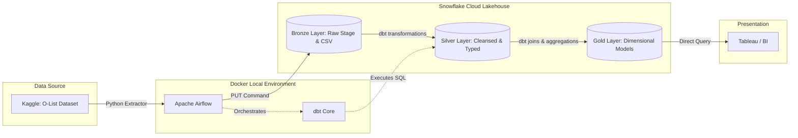

# 🛒 O-List E-Commerce Lakehouse: End-to-End Data Engineering Pipeline

    

## 📌 Executive Summary
This project is a fully automated, containerized ELT (Extract, Load, Transform) pipeline that ingests raw Brazilian E-Commerce data (O-List) and transforms it into a production-ready Snowflake Lakehouse. 

The architecture is designed to bridge the gap between raw operational data and business intelligence, culminating in a "Gold" data layer optimized for downstream analytics, customer segmentation, and operational reporting. 

## 🏗️ Architecture & Stack

* **Orchestration:** Apache Airflow (Dockerized, `LocalExecutor`)
* **Data Ingestion:** Python (Custom extraction and Snowflake `PUT` staging)
* **Data Warehouse:** Snowflake (Medallion Architecture)
* **Transformation:** dbt (data build tool)
* **Infrastructure:** Docker Compose (Bridging Windows host to Linux containers)

## ⚙️ The Pipeline (Medallion Architecture)
The pipeline operates on a daily Cron schedule (`@daily`) via Airflow, enforcing idempotency and guaranteeing that downstream transformations only occur upon successful upstream data ingestion.

1. **🥉 Bronze Layer (Raw Ingestion):** * A Python script connects to Kaggle, downloads the raw O-List CSV files, and stages them directly into a Snowflake internal `RAW_STAGE` using secure Service Role credentials.
2. **🥈 Silver Layer (Cleansing & Conforming):** * `dbt` reads the staged files via a custom `CSV_FORMAT` and normalizes the data. This layer enforces data typing, handles null values, and standardizes column naming conventions.
3. **🥇 Gold Layer (Business Value):** * `dbt` joins and aggregates the Silver tables into Kimball-style Dimensional models (`DIM_CUSTOMERS`, `DIM_PRODUCTS`, `FACT_ORDERS`). 

## 📊 Business Logic (The Gold Layer)
The ultimate goal of this Lakehouse is to answer critical business questions. The Gold layer tables are engineered to power dashboards for:
* **Customer Segmentation:** Analyzing geographic distribution and repeat purchase behavior.
* **Fulfillment Efficiency:** Tracking order delivery times from purchase to customer receipt.
* **Product Performance:** Identifying top-selling product categories and revenue drivers.

## 🚀 Execution & Automation Proof
*Note: Due to cloud trial constraints, this pipeline is documented via automated execution recordings.*
1. Environment is spun up via `docker compose up -d`.
2. The Airflow DAG (`olist_lakehouse_pipeline`) triggers the Python ingestion script.
3. Upon success, the DAG triggers the `dbt run` command inside the container to build the Silver and Gold models in Snowflake.

*See the `/docs` folder for screen recordings of the automated recovery ("Nuke & Rebuild") and the DAG dependency graphs.*

## ⚠️ Key Engineering Challenges Conquered
* **Dependency Matrix Conflicts:** Resolved a fatal container crash loop by explicitly upgrading the base Docker image (`apache/airflow:2.10.2-python3.11`) to satisfy strict `dbt-snowflake` and `click` library version requirements.
* **Docker Volume Isolation:** Engineered precise volume mappings in `docker-compose.yaml` to allow the isolated Linux Airflow container to successfully locate and process raw CSV files stored on the Windows host machine.
* **Silent Pipeline Failures:** Implemented strict error handling and logging to diagnose and fix a "Silent Success" where the ingestion script exited gracefully despite missing local data directories, ensuring true data idempotency.
* **RBAC Security Management:** Applied the Principle of Least Privilege in Snowflake, transferring schema and object ownership from `ACCOUNTADMIN` to a dedicated `TRANSFORMER_ROLE` service account for automated pipeline execution.

## 📊 Business Logic & Data Modeling (The "Why")

The raw Brazilian E-Commerce dataset is heavily normalized across multiple transactional tables. While efficient for an application backend, it is highly inefficient for analytical queries. 

I architected the **Gold Layer** using a Kimball-style Star Schema. By denormalizing the Silver layer into distinct Fact and Dimension tables, I optimized the Lakehouse for read-heavy BI workloads, ensuring Tableau dashboards load instantly. 

Here is the strategic reasoning behind the Gold models:

* **`DIM_CUSTOMERS`:** * **The Problem:** Customer location data was siloed in a separate geolocation table.
  * **The Logic:** I joined the customer data with the geolocation dataset to create a single, enriched dimension. This allows business analysts to instantly segment users by state and zip code prefix without writing complex SQL joins, powering regional marketing campaigns.
* **`DIM_PRODUCTS`:** * **The Problem:** Product category names were in Portuguese, and metrics like "name length" and "photo quantity" were buried.
  * **The Logic:** I translated the categories to English and isolated the product attributes. This allows the business to analyze if richer product listings (more photos, longer descriptions) correlate with higher sales volume.
* **`FACT_ORDERS`:** * **The Problem:** Order timestamps, item prices, and freight values were scattered across three different raw tables.
  * **The Logic:** I centralized the quantitative metrics at the grain of an individual `order_item_id`. By calculating delivery duration (delivered date vs. estimated date), this Fact table serves as the central nervous system for measuring fulfillment efficiency and total revenue generation.